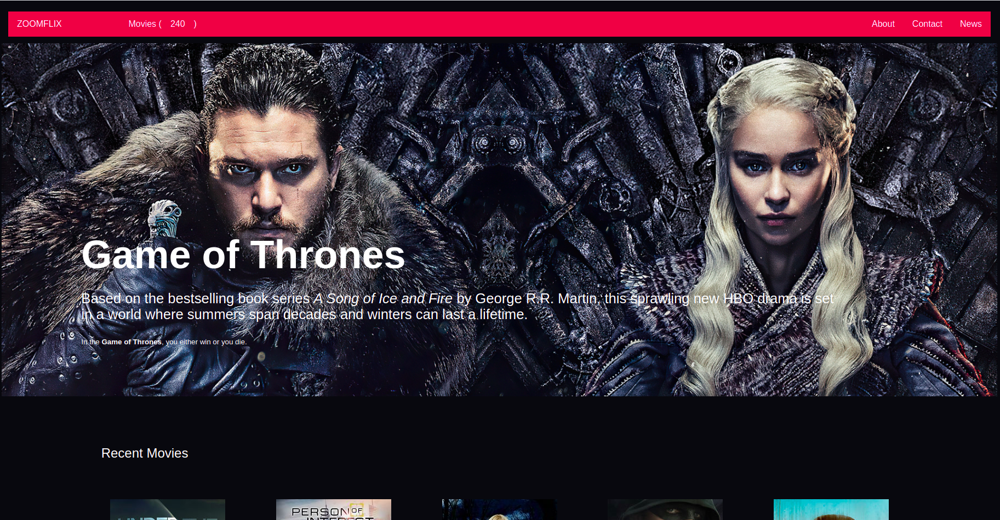

# ZOOMFLIX

ZOOMFLIX JavaScript-API-based-webapp for movies and favorite TV shows.
it offers a library of films and television series through distribution deals as well as its own productions,

## Built With 
 - HTML
 - CSS
 - Javascript
 - webpack 
## Getting started
to run the project locally, clone the project using the command 

`https://github.com/banlon-jones/JavaScript-API-based-webapp.git`
navigate in to the project directory, from GitHub,
- install project dependencies run the command
`npm install`
- Runs the app in the development mode. `npm start`
- Open http://localhost:8080 to view it in the browser.

# Demo
https://banlon-jones.github.io/JavaScript-API-based-webapp/

## Authors

### Author 1
 - Github: [banlon-jones](https://github.com/banlon-jones)
 - LinkedIn: [banlon jones](https://www.linkedin.com/in/banlon-jones-b0205812a)
 
 ### Author 2
  - Github: [Milan Protic](https://github.com/mprotic123)
  - LinkedIn: [Milan Protić ](https://www.linkedin.com/in/milan-proti%C4%87-040364213/)
 

## Acknowledgments

- inspiration from Microverse 
https://github.com/microverseinc/curriculum-javascript/blob/main/group-capstone/js_capstone.md
